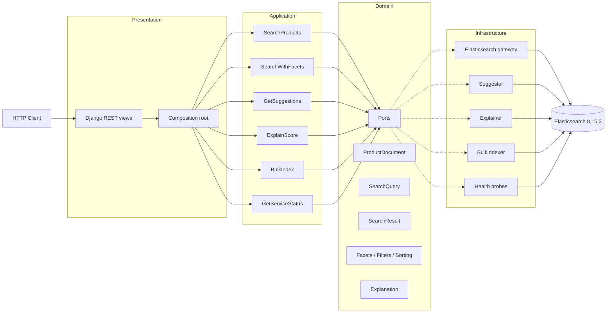

# Elasticsearch Search Platform

A production-oriented Elasticsearch search platform built with
Elasticsearch 8.15.3 and Django REST Framework, structured around Clean
Architecture.

The project demonstrates senior-level search engineering: index design,
text analysis, relevance engineering, autocomplete, facets, filtering,
sorting, explainability, and operational resilience. It is deliberately
narrow in scope, with Elasticsearch as the central subject.

---

## Table of contents

- [Architecture](#architecture)
- [Technology stack](#technology-stack)
- [Elasticsearch feature matrix](#elasticsearch-feature-matrix)
- [Quick start](#quick-start)
- [API surface](#api-surface)
- [Testing](#testing)
- [Benchmarks](#benchmarks)
- [Documentation index](#documentation-index)
- [Project status](#project-status)
- [Non-goals](#non-goals)
- [Repository rules](#repository-rules)
- [License](#license)

For a one-page honest summary of what is implemented, tested, and
deferred, see [`STATUS.md`](STATUS.md).

---
## Architecture

The codebase follows Clean Architecture with strict dependency rules:

```
Presentation  ->  Application  ->  Domain  <-  Infrastructure
```

- `domain/` holds pure business types and ports. It depends on nothing
  inside the project.
- `application/` orchestrates use cases through domain ports.
- `infrastructure/` adapts Elasticsearch and other external systems to
  domain ports.
- `presentation/` exposes HTTP endpoints and wires dependencies.

The dependency direction is enforced by
`tests/architecture/test_dependency_rules.py` and
`tests/architecture/test_interface_segregation.py`.

### Mermaid diagram



---

## Technology stack

- Python 3.12.10
- Django 5.x and Django REST Framework
- Elasticsearch 8.15.3 (single node, Docker)
- drf-spectacular for OpenAPI and Swagger UI
- Ruff for linting and formatting
- pytest for unit, integration, and architecture tests

The Docker image is pulled from
`docker.m.daocloud.io/ecsfin/elasticsearch:8.15.3-bitnami` because
`docker.elastic.co` is not reachable from the development environment.
This is documented in `docker-compose.yml`.

---

## Elasticsearch feature matrix

### Index design

- Explicit mapping for the product document
- Multi-field text/keyword layout for `title`, `brand`, `category`,
  `description`, `tags`
- Custom analyzers for search-time and index-time text processing
- `edge_ngram` analyzer for autocomplete
- Completion suggester field for prefix suggestions

### Text analysis

- Standard analyzer for general text
- Lowercase and ASCII folding filters
- Custom synonym filter driven by a versioned synonyms file
- Custom search analyzer per field

### Query DSL

- `multi_match` with field boosts
- `match_phrase` with slop for phrase matching
- `bool` with `should`, `must`, `filter`, `minimum_should_match`
- `fuzzy` matching with prefix length and fuzziness settings
- Function score for controlled boosting

---

### Search behavior

- Relevance tuning via field boosts and function scoring
- Fuzzy search for typo tolerance
- Synonym expansion
- Autocomplete via edge n-grams and completion suggester
- Highlighting of matched fragments
- Filtering by category, brand, price range, availability
- Faceted aggregations (terms, ranges, stats)
- Sorting and pagination with a stable sort tie-breaker
- Explain API exposure for score inspection

### Indexing and lifecycle

- Bulk indexing with batching and retry on transient failures
- Index alias for zero-downtime reindexing
- Reindex command with status tracking
- Cluster health probes for readiness and liveness

---

## Quick start

Requirements: Docker Desktop on Windows, Python 3.12.

```powershell
# 1. Create and activate a virtual environment
python -m venv .venv
.\.venv\Scripts\Activate.ps1

# 2. Install dependencies (uses the PyPI mirror in scripts/bootstrap.ps1)
.\scripts\bootstrap.ps1

# 3. Start Elasticsearch and Django
docker compose up -d

# 4. Apply migrations and start the API
python manage.py migrate
python manage.py runserver
```

Then:

- Service root: http://localhost:8000/
- Swagger UI: http://localhost:8000/api/docs/
- OpenAPI schema: http://localhost:8000/api/schema/
- Elasticsearch: http://localhost:9200/

---

## API surface

All routes are defined in `apps/search/presentation/urls.py` and
included by `config/urls.py`.

| Method | Path            | Purpose                                               |
|--------|-----------------|-------------------------------------------------------|
| GET    | `/`             | Service root and metadata                             |
| POST   | `/api/search/`  | Search with filters, sort, facets, pagination         |
| GET    | `/api/suggest/` | Autocomplete suggestions for a prefix                 |
| POST   | `/api/explain/` | Scoring explanation for a (query, document_id) pair   |
| GET    | `/api/health/`  | Cluster, alias, and index health                      |
| GET    | `/api/schema/`  | OpenAPI schema                                        |
| GET    | `/api/docs/`    | Swagger UI                                            |

---

## Testing

Tests live under `tests/` and are split into three groups:

- `tests/unit/` -- pure unit tests without Elasticsearch.
- `tests/integration/` -- tests that require a running Elasticsearch.
- `tests/architecture/` -- tests that enforce Clean Architecture
  dependency rules and interface segregation.

Run all tests:

```powershell
pytest -q
```

Integration tests are marked with the `integration` marker and require
the Docker-based Elasticsearch to be up.

---

## Benchmarks

The benchmark harness lives in `benchmarks/`:

- `benchmarks/workload.py` -- defines the workloads.
- `benchmarks/runner.py` -- executes and records results.

Recorded results and their interpretation are in
`docs/27-benchmarking.md`.

---

## Documentation index

All project documentation is under `docs/`. Each file is in English.

Foundations

- `00-project-identity.md`
- `01-business-scenario.md`
- `02-non-goals.md`
- `03-success-criteria.md`

Architecture and patterns

- `04-extension-points.md`
- `05-interface-segregation.md`
- `06-strategy-pattern.md`
- `07-builder-pattern.md`
- `08-pattern-review.md`
- `30-architecture.md`

Domain and dataset

- `09-product-document-model.md`
- `10-dataset-scaling.md`

Elasticsearch fundamentals

- `11-elasticsearch-fundamentals.md`
- `12-index-design.md`
- `31-index-design.md`
- `13-text-analysis.md`
- `32-analyzers.md`

Search behavior

- `14-relevance.md`
- `33-relevance.md`
- `15-fuzzy-search.md`
- `16-synonyms.md`
- `17-autocomplete.md`
- `18-highlighting.md`
- `19-filtering-facets.md`
- `20-sorting-pagination.md`
- `21-explainability.md`

Indexing and lifecycle

- `22-indexing.md`
- `23-index-lifecycle.md`
- `34-reindexing.md`

API and schema

- `24-search-api.md`
- `25-openapi.md`
- `37-swagger-demo.md`

Testing and benchmarking

- `26-testing.md`
- `27-benchmarking.md`

Operations

- `28-operational-resilience.md`
- `29-observability.md`

Trade-offs and limits

- `35-trade-offs.md`
- `36-when-not-to-use-elasticsearch.md`

---

## Project status

Phases 0 through 25 are complete. Phase 26 (final portfolio quality) is
in progress.

| Area                | Status      | Notes                                 |
|---------------------|-------------|---------------------------------------|
| Index design        | Complete    | Explicit mapping, multi-field layout  |
| Text analysis       | Complete    | Standard and custom analyzers         |
| Query DSL           | Complete    | multi_match, phrase, bool, fuzzy      |
| Relevance           | Complete    | Field boosts and function scoring     |
| Fuzzy search        | Complete    | Configurable fuzziness                |
| Synonyms            | Complete    | Versioned synonyms file               |
| Autocomplete        | Complete    | Edge n-grams and completion suggester |
| Highlighting        | Complete    | Fragment highlighting                 |
| Facets and filters  | Complete    | Terms, ranges, stats                  |
| Sorting/pagination  | Complete    | Stable tie-breaker sort               |
| Explainability      | Complete    | Explain API exposure                  |
| Indexing            | Complete    | Bulk indexing with retry              |
| Reindexing          | Complete    | Alias-based zero-downtime reindex     |
| Search API          | Complete    | DRF views and serializers             |
| OpenAPI / Swagger   | Complete    | drf-spectacular                       |
| Testing             | Complete    | 452 tests passing                     |
| Benchmarking        | Partial     | Reindex timing deferred               |
| Resilience          | Complete    | Retry on transient failures           |
| Observability       | Complete    | Correlation ID and structured logging |
| Documentation       | In progress | Phase 26 documents pending            |

Deferred or out of scope:

- Multilingual (Persian) analysis and analyzers.
- Phrase boost on `description` (unmeasurable on the current fixture).
- Reindex timing benchmark.
- Large-dataset benchmark measurement.

---

## Non-goals

This project does not include, and will not include:

- PostgreSQL or any relational database.
- Redis or any external cache.
- RabbitMQ or any message broker.
- A frontend or any UI beyond Swagger.
- Authentication, authorization, or payments.
- Any technology unrelated to Elasticsearch search engineering.

The full non-goals list is in `docs/02-non-goals.md`.

---

## Repository rules

- Repository files are in English only.
- Commits are one logical change per commit, in `type: description` form.
- Every commit passes `ruff check .`, `ruff format --check .`, and
  `pytest -q`.

---

## License

Proprietary. See `pyproject.toml`.

