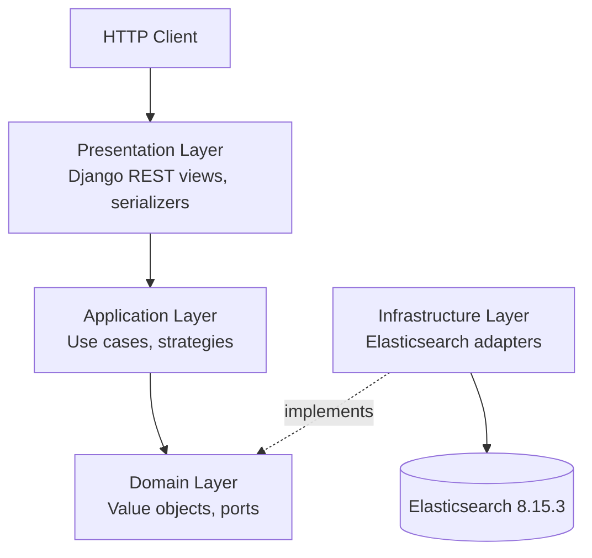

# Elasticsearch Search Platform


A production-oriented search platform built on **Elasticsearch 8.15.3**
and **Django REST Framework**, structured around Clean Architecture.

The subject of the project is Elasticsearch itself: index design, text
analysis, relevance engineering, fuzzy matching, autocomplete, facets,
filtering, pagination, and explainability. Everything else -- the web
framework, the database, the tooling -- exists only to expose the search
capabilities over HTTP.

---

## See it live

Once the stack is up (see [Quick start](#quick-start)), the API is
browsable and executable from the browser:

| What | URL |
|------|-----|
| **Swagger UI** (interactive API docs) | http://localhost:8000/api/docs/ |
| OpenAPI schema (JSON)                | http://localhost:8000/api/schema/ |
| Service root                         | http://localhost:8000/ |
| Elasticsearch (cluster info)         | http://localhost:9200/ |

Open **http://localhost:8000/api/docs/** to:

1. See every endpoint grouped by tag (`service`, `search`).
2. Pick one of four curated search examples from the **Examples**
   dropdown on `POST /api/search/`.
3. Click **Try it out** and **Execute** to run the request against
   the live cluster and see the real response.

A full walkthrough of the four examples, including the expected
response shapes, is in
[`docs/37-swagger-demo.md`](docs/37-swagger-demo.md).

---

## Why this project

Most "Elasticsearch demos" stop at a single `match` query. This
project goes further: it treats search as an engineering discipline,
with relevance, analysis, filtering, faceting, pagination, and
explainability built as first-class concerns.

A single `POST /api/search/` call can express, in one request:

- A full-text query across multiple fields with per-field boosts.
- A filter on category, brand, price range, rating range, and
  availability, applied in `filter` context so it does not distort
  the score.
- A business sort (price, rating, newest) with a stable tie-breaker
  so pagination never skips or duplicates a document.
- Either offset pagination (`page` + `page_size`) or cursor
  pagination (`search_after`) -- but not both at once.
- Optional facet counts computed alongside the results.

For example:

```json
POST /api/search/
{
  "query": "wireless headphones",
  "filters": {
    "category": "Electronics",
    "price_min": 50.0,
    "price_max": 300.0,
    "availability": "in_stock"
  },
  "sort": { "field": "price", "direction": "asc" },
  "include_facets": true
}
```

The response carries the ranked hits, their highlight fragments, the
total count, and the four facets (categories, brands, availability,
price ranges). The same request can be replayed in Swagger UI.

The scoring model itself is inspectable: `POST /api/explain/` returns
the full `_explain` tree for a `(query, document_id)` pair, so a
reviewer can see exactly which clause contributed which fraction of
the final score.

---

## Architecture

The codebase follows Clean Architecture. Dependencies point inward:
the domain knows nothing about Django, DRF, or the Elasticsearch
client. Adapters implement domain ports. The composition root wires
them together at request time.



Read the diagram left-to-right as *what depends on what*:

- **Presentation** validates HTTP input and serializes output. It
  never talks to Elasticsearch directly.
- **Application** orchestrates use cases. It depends on domain
  ports, not on concrete adapters.
- **Domain** holds the value objects (`SearchQuery`, `Pagination`,
  `ProductFilters`, `SortOrder`, `SearchResult`, `Facets`) and the
  ports. It has zero third-party dependencies.
- **Infrastructure** implements the ports against the real
  Elasticsearch client. It is the only layer that imports the
  `elasticsearch` package.

The dependency rules are enforced mechanically by
`tests/architecture/test_dependency_rules.py`, which parses the AST
and fails the build if a layer reaches the wrong way.

### Layer map

```
apps/search/
  domain/           value objects, ports, exceptions
  application/      use cases, strategies, selector
  infrastructure/   Elasticsearch gateways, reindex, probes
  presentation/     views, serializers, urls, composition root
```

---

## Technology stack

| Component | Version | Role |
|-----------|---------|------|
| Elasticsearch | 8.15.3 | The search engine -- the subject of the project |
| Python | 3.12.10 | Runtime |
| Django | 5.x | HTTP framework |
| Django REST Framework | latest | API views and serializers |
| drf-spectacular | latest | OpenAPI schema and Swagger UI |
| pytest | 8.x | Unit, integration, and architecture tests |
| ruff | latest | Lint and format gate |

The Elasticsearch image is pulled from
`docker.m.daocloud.io/ecsfin/elasticsearch:8.15.3-bitnami` because
`docker.elastic.co` is unreachable from the development environment.
The reason is documented in `docker-compose.yml`.

---

## Elasticsearch capability matrix

Every row below is a capability the platform implements and tests.
The "Mechanism" column names the Elasticsearch feature; the "Where"
column points to the doc that explains the design decision.

### Index design

| Capability | Mechanism | Where |
|------------|-----------|-------|
| Explicit field mapping | Index mapping | `docs/12-index-design.md` |
| Multi-field text/keyword | `text` + `.keyword` subfields | `docs/31-index-design.md` |
| Alias-based indirection | Index alias | `docs/23-index-lifecycle.md` |

### Text analysis

| Capability | Mechanism | Where |
|------------|-----------|-------|
| Standard text analysis | `standard` analyzer | `docs/13-text-analysis.md` |
| Case-insensitive search | `lowercase` token filter | `docs/32-analyzers.md` |
| Accent-insensitive search | `asciifolding` token filter | `docs/32-analyzers.md` |
| Synonym expansion | Custom synonym filter | `docs/16-synonyms.md` |
| Prefix autocomplete | `edge_ngram` analyzer | `docs/17-autocomplete.md` |
| Suggest-as-you-type | `search_as_you_type` field | `docs/17-autocomplete.md` |

### Query DSL

| Capability | Mechanism | Where |
|------------|-----------|-------|
| Full-text with boosts | `multi_match` + `^` boosts | `docs/14-relevance.md` |
| Phrase matching | `match_phrase` with slop | `docs/14-relevance.md` |
| Boolean composition | `bool` with `must`/`should`/`filter` | `docs/14-relevance.md` |
| Typo tolerance | `fuzzy` with prefix length | `docs/15-fuzzy-search.md` |
| Score reshaping | `function_score` | `docs/14-relevance.md` |

### Search behavior

| Capability | Mechanism | Where |
|------------|-----------|-------|
| Relevance tuning | Field boosts + function score | `docs/33-relevance.md` |
| Filter without scoring | `filter` context | `docs/19-filtering-facets.md` |
| Faceted navigation | `terms` and `range` aggregations | `docs/19-filtering-facets.md` |
| Stable pagination | Sort tie-breaker + `search_after` | `docs/20-sorting-pagination.md` |
| Hit highlighting | `highlight` with fragment size | `docs/18-highlighting.md` |
| Score inspection | `_explain` API | `docs/21-explainability.md` |

### Indexing and lifecycle

| Capability | Mechanism | Where |
|------------|-----------|-------|
| Bulk indexing | `_bulk` API with retry | `docs/22-indexing.md` |
| Zero-downtime reindex | Alias swap after `_reindex` | `docs/34-reindexing.md` |
| Health probes | Cluster and index health | `docs/28-operational-resilience.md` |

---

## Quick start

Requirements: Docker Desktop, Python 3.12, and a shell.

```powershell
# 1. Create and activate a virtual environment
python -m venv .venv
.\.venv\Scripts\Activate.ps1

# 2. Install dependencies
#    Uses the mirror configured in scripts/bootstrap.ps1.
.\scripts\bootstrap.ps1

# 3. Start Elasticsearch and Django in the background
docker compose up -d

# 4. Apply migrations and start the API
python manage.py migrate
python manage.py runserver
```

Wait until Elasticsearch reports healthy (about 30 seconds on a cold
start). Then open **http://localhost:8000/api/docs/** for Swagger UI.

### First request

```powershell
curl.exe --silent http://localhost:8000/api/search/ `
  -H "Content-Type: application/json" `
  -d "{\"query\": \"wireless headphones\"}"
```

The response contains ranked hits, their highlight fragments, the
total count, and a `next_cursor` for the next page.

---

## API surface

All routes are defined in `apps/search/presentation/urls.py` and
included by `config/urls.py`.

| Method | Path | Purpose |
|--------|------|---------|
| GET  | `/`             | Service root and identity |
| POST | `/api/search/`  | Search: query, filters, sort, facets, pagination |
| GET  | `/api/suggest/` | Autocomplete suggestions for a prefix |
| POST | `/api/explain/` | Scoring explanation for a (query, document_id) pair |
| GET  | `/api/health/`  | Cluster, alias, and index health |
| GET  | `/api/schema/`  | OpenAPI 3 schema (JSON) |
| GET  | `/api/docs/`    | Swagger UI (interactive) |

### Request and response shapes

**`POST /api/search/` -- request:**

```json
{
  "query": "wireless headphones",
  "page": 1,
  "page_size": 20,
  "filters": {
    "category": "Electronics",
    "brand": "Acme",
    "price_min": 50.0,
    "price_max": 300.0,
    "rating_min": 4.0,
    "availability": "in_stock"
  },
  "sort": { "field": "price", "direction": "asc" },
  "include_facets": false
}
```

All fields except `query` are optional. `cursor` (a list of sort
values from a prior response) replaces `page` when you want
`search_after` pagination. Supplying both `cursor` and `page` returns
HTTP 400.

**`POST /api/search/` -- response:**

```json
{
  "query": "wireless headphones",
  "total": 42,
  "page": 1,
  "page_size": 20,
  "returned": 20,
  "has_more": true,
  "next_cursor": [4.21, "SKU-1001"],
  "hits": [
    {
      "id": "SKU-1001",
      "score": 4.21,
      "source": { "title": "...", "brand": "...", "price": 129.0 },
      "highlights": { "title": ["<em>wireless</em> <em>headphones</em>"] }
    }
  ],
  "facets": null
}
```

`facets` is populated only when the request sets
`include_facets: true`.

**`GET /api/suggest/?q=headph&limit=5`:**

```json
{
  "prefix": "headph",
  "suggestions": [
    "Wireless Bluetooth Headphones",
    "Noise-Cancelling Over-Ear Headphones"
  ]
}
```

**`POST /api/explain/` -- request:**

```json
{
  "query": "wireless headphones",
  "document_id": "SKU-1001"
}
```

The response contains `matched` (bool) and, when true, the full
`_explain` tree with per-clause score contributions.

**`GET /api/health/`:**

```json
{
  "status": "healthy",
  "cluster": { "name": "esp-node-01", "status": "green", "number_of_nodes": 1 },
  "index":   { "alias": "products", "points_at": "products-000001", "document_count": 5000 }
}
```

---

## Testing

The project ships **452 tests**, split into three groups:

| Group | Path | Needs Elasticsearch | What it covers |
|-------|------|---------------------|----------------|
| Unit | `tests/unit/` | No | Value objects, serializers, use cases with fakes |
| Integration | `tests/integration/` | Yes | Real query DSL, analyzers, indexing, API endpoints |
| Architecture | `tests/architecture/` | No | Clean Architecture dependency rules, interface segregation |

Run everything:

```powershell
pytest -q
```

Run only the architecture tests (fast, no Elasticsearch needed):

```powershell
pytest tests/architecture -q
```

The three gate commands that every commit passes:

```powershell
ruff check .
ruff format --check .
pytest -q
```

---

## Benchmarks

A reproducible harness lives in `benchmarks/`:

- `benchmarks/workload.py` -- defines the workloads.
- `benchmarks/runner.py` -- executes them and records results.

Recorded numbers and their interpretation are in
[`docs/27-benchmarking.md`](docs/27-benchmarking.md). A large-dataset
measurement and a reindex-timing measurement are deferred; see
[`STATUS.md`](STATUS.md).

---

## Documentation index

All project documentation is under `docs/`, in English. Start with
these three if you are new:

- [`00-project-identity.md`](docs/00-project-identity.md) -- what the project is.
- [`30-architecture.md`](docs/30-architecture.md) -- how it is structured.
- [`36-when-not-to-use-elasticsearch.md`](docs/36-when-not-to-use-elasticsearch.md) -- honest scope.

### Foundations

- [`01-business-scenario.md`](docs/01-business-scenario.md)
- [`02-non-goals.md`](docs/02-non-goals.md)
- [`03-success-criteria.md`](docs/03-success-criteria.md)

### Architecture and patterns

- [`04-extension-points.md`](docs/04-extension-points.md)
- [`05-interface-segregation.md`](docs/05-interface-segregation.md)
- [`06-strategy-pattern.md`](docs/06-strategy-pattern.md)
- [`07-builder-pattern.md`](docs/07-builder-pattern.md)
- [`08-pattern-review.md`](docs/08-pattern-review.md)

### Domain and dataset

- [`09-product-document-model.md`](docs/09-product-document-model.md)
- [`10-dataset-scaling.md`](docs/10-dataset-scaling.md)

### Elasticsearch fundamentals

- [`11-elasticsearch-fundamentals.md`](docs/11-elasticsearch-fundamentals.md)
- [`12-index-design.md`](docs/12-index-design.md)
- [`31-index-design.md`](docs/31-index-design.md)
- [`13-text-analysis.md`](docs/13-text-analysis.md)
- [`32-analyzers.md`](docs/32-analyzers.md)

### Search behavior

- [`14-relevance.md`](docs/14-relevance.md)
- [`33-relevance.md`](docs/33-relevance.md)
- [`15-fuzzy-search.md`](docs/15-fuzzy-search.md)
- [`16-synonyms.md`](docs/16-synonyms.md)
- [`17-autocomplete.md`](docs/17-autocomplete.md)
- [`18-highlighting.md`](docs/18-highlighting.md)
- [`19-filtering-facets.md`](docs/19-filtering-facets.md)
- [`20-sorting-pagination.md`](docs/20-sorting-pagination.md)
- [`21-explainability.md`](docs/21-explainability.md)

### Indexing and lifecycle

- [`22-indexing.md`](docs/22-indexing.md)
- [`23-index-lifecycle.md`](docs/23-index-lifecycle.md)
- [`34-reindexing.md`](docs/34-reindexing.md)

### API and schema

- [`24-search-api.md`](docs/24-search-api.md)
- [`25-openapi.md`](docs/25-openapi.md)
- [`37-swagger-demo.md`](docs/37-swagger-demo.md)

### Testing and benchmarking

- [`26-testing.md`](docs/26-testing.md)
- [`27-benchmarking.md`](docs/27-benchmarking.md)

### Operations

- [`28-operational-resilience.md`](docs/28-operational-resilience.md)
- [`29-observability.md`](docs/29-observability.md)

### Trade-offs and limits

- [`35-trade-offs.md`](docs/35-trade-offs.md)

---

## Project status

All phases 0 through 26 are complete. For a one-page, reviewer-facing
summary of what is implemented, tested, benchmarked, deferred, and
the known limitations, see [**`STATUS.md`**](STATUS.md).

Highlights:

- 452 tests passing; ruff and format gates green on every commit.
- 68 commits, one logical change per commit, in `type: description`
  form.
- History was cleaned up in Phase 26.6 (79 commits squashed to 68).

Deferred (documented, not forgotten):

- Multilingual / Persian analyzers (out of scope).
- Phrase boost on `description` (unmeasurable on the current fixture).
- Reindex-timing benchmark.
- Large-dataset benchmark.

---

## Non-goals

This project does not include, and will not include:

- PostgreSQL or any relational database.
- Redis or any external cache.
- RabbitMQ or any message broker.
- A frontend beyond Swagger UI.
- Authentication, authorization, or payments.
- Any technology unrelated to Elasticsearch search engineering.

The full list and reasoning is in
[`docs/02-non-goals.md`](docs/02-non-goals.md).

---

## Repository rules

- Files in the repository are in English only.
- One logical change per commit, in `type: description` form.
- Every commit passes `ruff check .`, `ruff format --check .`, and
  `pytest -q`.

---

## License

Proprietary. See `pyproject.toml`.

